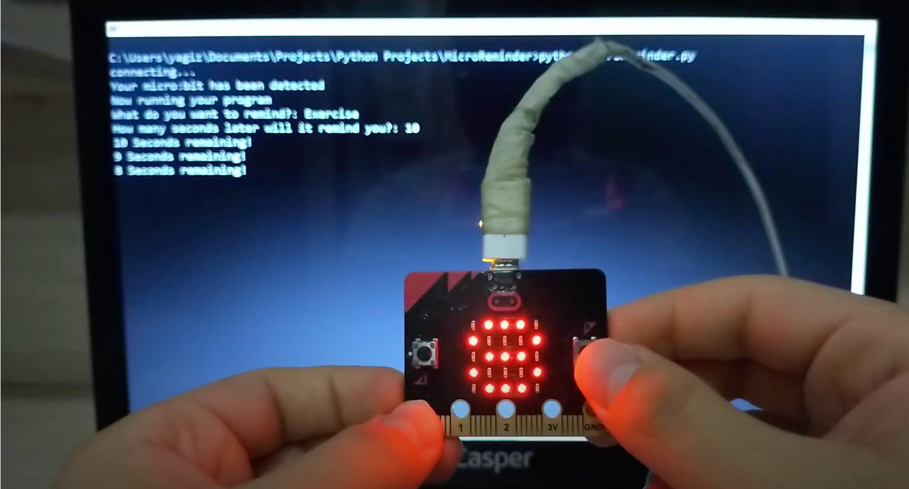

# MicroReminder

MicroReminder is a activity reminder using with [micro:bit](https://microbit.org). You specify a period of time, and MicroReminder reminds you when the time comes. Using the project you need 2 modules. These Modules:

- [David Whale's](https://github.com/whaleygeek) [bitio library,](https://github.com/whaleygeek/bitio) to run Python codes directly on the micro:bit.

- [W10toast,](https://pypi.org/project/win10toast/) for push notification to destkop.  

## Installation

To use MicroReminder, the following are required:

1. If Python Is Not Installed, [download Python 3.6 from this link](https://www.python.org/downloads/release/python-360/)

2. If you don't already have Pip, [install it by following these instructions](https://pip.pypa.io/en/stable/installing/). Pip is a "package manager" for Python, and makes getting set up with Python packages really easy.

3. Install required modules for MicroReminder

**Using Command Line**

Open a command line window. Type the following:

```git clone https://github.com/codermyagiz/MicroReminder```

To install this latest code

Navigate to the MicroReminder folder in your command line window using the ['cd' command](https://en.wikipedia.org/wiki/Cd_(command)) - you may need to change the path, depending on how you've configured git on your computer:

```cd MicroReminder```

Next, install the required modules:

```pip install -U -q -r requirements.txt```

**Setting up the bitio library**

See [this](https://github.com/whaleygeek/bitio#getting-started) to set up [David Whale](https://github.com/whaleygeek)'s [bitio library](https://github.com/whaleygeek/bitio).

### Setting up your MicroReminder
Connect your micro:bit to your computer. Get the latest [bitio.hex](https://github.com/whaleygeek/bitio/raw/master/bitio.hex) from the bitio repository, and [drag this hex file to your micro:bit to 'flash' it to the device](https://microbit.org/guide/hardware/usb/).

If you're on Windows, you'll also need to [install the Windows serial driver](https://support.microbit.org/support/solutions/articles/19000022103-how-do-i-use-the-serial-port-with-a-micro-bit-on-windows) on your computer.

#### Usage:
1. First, connect the micro:bit to the computer with a usb cable.
2. Write ```python MicroReminder.py``` on the open command line.
3. Now the "tick" will appear on the leds of the microbit. This means that it was successfully installed.
4. Write down the action you want to remember and determine the duration. You can also increase the time by holding down the A button on the Micro:Bit.
5. Press and hold the B button to start the move reminder counter.
6. **Done!**

## Project Video:
[](https://youtu.be/nGOxDalNg6A)

*I set the time to **10 seconds** for the test.*

## Note:
I would like to thank [Musab Kilic](https://github.com/musabkilic) for allowing me to excerpt the readme file in the [MicroBike](https://github.com/musabkilic/MicroBike) project.

<p align="center">
	Muzaffer Yağız Yasak<br/>
	@yagizyasak<br/>
	<a href="https://github.com/codermyagiz/MicroReminder/blob/master/LICENSE">Licensed under the GNU General Public License v3.0</a>
</p>
